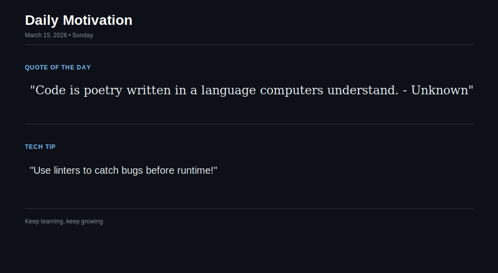

  

<h1 align="center">Cloud Automation & DevOps Engineer 🚀</h1>

  

---

## About Me

I'm a **Cloud Automation and DevOps Engineer** passionate about building scalable, secure, and efficient cloud solutions. I specialize in automating cloud processes and streamlining CI/CD pipelines to help organizations achieve seamless operations.

---

## My Skillset

I work with a variety of technologies and tools, including:

### Cloud Platforms
- **Azure**
- **Entra ID**

### Programming & Scripting
- **PowerShell**
- **Python**
- **Bash**

### Serverless & Automation
- **Azure Functions**
- **Power Apps**
- **Power Automate**
- **Microsoft 365 Automation**

### CI/CD & DevOps Tools
- **Jenkins**
- **GitLab**
- **Bitbucket**
- **Kubernetes**
- **JFrog**
- **APIGEE**

  <!-- Example badges (from Shields.io) -->
  
  
  
  
  
  

---

## What I Do

I design and implement cloud architectures, develop serverless functions, and automate workflows to empower organizations with efficient and secure cloud solutions. Some areas I focus on include:

- **Automation:** Utilizing PowerShell and Python to automate repetitive tasks and streamline operations.
- **CI/CD Pipelines:** Building robust pipelines with tools like Jenkins, GitLab, Bitbucket and Kubernetes.
- **Integration & Security:** Implementing solutions using APIGEE to secure and integrate diverse systems also automating scripts for various security bug fixes or new implementations.

  

---

## 💬 Testimonials

Here's the recent IT Blog of E2E Automation I have worked on: [BLOG](https://blogit.michelin.io/cloud-to-cloud-automation-with-servicenow/).

---

Explore more on my [GitHub Profile](https://github.com/rajat-khonde).

---

## Connect with Me

I'm always open to new opportunities and collaborations. Feel free to connect with me:

- **LinkedIn:** [Rajat Khonde](https://www.linkedin.com/in/rajat-khonde-450b46119/)
- **Email:** [rajatkhonde@gmail.com](mailto:rajatkhonde@gmail.com)

---

## GitHub Stats

  

---

## 💫 Daily Dev Motivation

The below is built using [this](./build-svg.ps1) PowerShell script, which runs daily at 4:00 AM UTC via [this](./.github/workflows/UpdateReadme.yml) GitHub Action.

  

---

  

